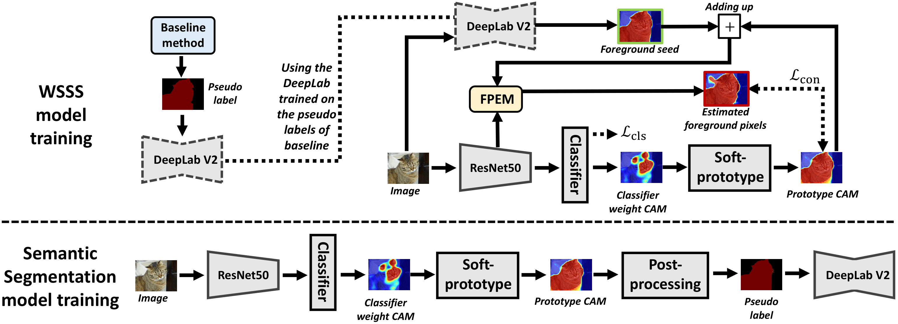

# PSDPM: Prototype-based Secondary Discriminative Pixels Mining for Weakly Supervised Semantic Segmentation



The implementation of [**PSDPM: Prototype-based Secondary Discriminative Pixels Mining for Weakly Supervised Semantic Segmentation**](https://openaccess.thecvf.com/content/CVPR2024/papers/Zhao_PSDPM_Prototype-based_Secondary_Discriminative_Pixels_Mining_for_Weakly_Supervised_Semantic_CVPR_2024_paper.pdf), Xinqiao Zhao∗, Ziqian Yang∗, Tianhong Dai, Bingfeng Zhang, Jimin Xiao, CVPR 2024.

## Abstract
Image-level Weakly Supervised Semantic Segmentation (WSSS) has received increasing attention due to its low annotation cost. Class Activation Mapping (CAM) generated through classifier weights in WSSS inevitably ignores certain useful cues, while the CAM generated through class prototypes can alleviate that. However, because of the different goals of image classification and semantic segmentation, the class prototypes still focus on activating primary discriminative pixels learned from classification loss, leading to incomplete CAM. In this paper, we propose a plug-and-play Prototype-based Secondary Discriminative Pixels Mining (PSDPM) framework for enabling class prototypes to activate more secondary discriminative pixels, thus generating a more complete CAM. Specifically, we introduce a Foreground Pixel Estimation Module (FPEM) for estimating potential foreground pixels based on the correlations between primary and secondary discriminative pixels and the semantic segmentation results of baseline methods. Then, we enable WSSS model to learn discriminative features from secondary discriminative pixels through a consistency loss calculated between FPEM result and class-prototype CAM. Experimental results show that our PSDPM improves various baseline methods significantly and achieves new state-of-the-art performances on WSSS benchmarks.

## Environment

- Python >= 3.6.6
- Pytorch >= 1.6.0
- Torchvision

## Usage

#### Step 1. Prepare Dataset

- PASCAL VOC 2012: [Download](http://host.robots.ox.ac.uk/pascal/VOC/voc2012/).
- MS COCO 2014: [Image](https://cocodataset.org/#home) and [Label](https://drive.google.com/file/d/1Pm_OH8an5MzZh56QKTcdlXNI3RNmZB9d/view?usp=sharing).


#### Step 2. Prepare Pseudo Labels

- Train the baseline model and download their pseudo label (.npy) file into gtimg1/

#### Step 3. Train PSDPM

```bash
# PASCAL VOC 2012
bash run_voc.sh

# MS COCO 2014
bash run_coco.sh
```

#### Step 4. Train Fully Supervised Segmentation Models

To train fully supervised segmentation models, we refer to [deeplab-pytorch](https://github.com/kazuto1011/deeplab-pytorch) and [seamv1](https://github.com/YudeWang/semantic-segmentation-codebase/tree/main/experiment/seamv1-pseudovoc).


## Citation
```
@inproceedings{zhao2024psdpm,
  title={Psdpm: Prototype-based secondary discriminative pixels mining for weakly supervised semantic segmentation},
  author={Zhao, Xinqiao and Yang, Ziqian and Dai, Tianhong and Zhang, Bingfeng and Xiao, Jimin},
  booktitle={Proceedings of the IEEE/CVF conference on computer vision and pattern recognition},
  pages={3437--3446},
  year={2024}
}

```
